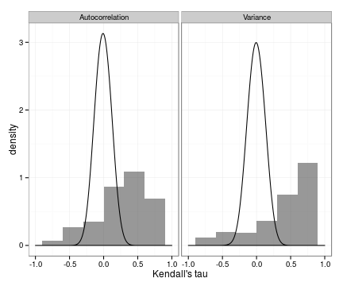
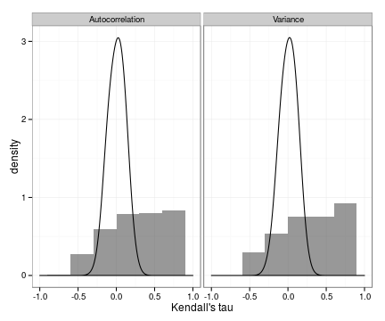

## Reproducing the full analysis

All simulation data and analyses can be generated and reproduced following the code
provided in the R scripts, Figure1.Rmd, Figure2.Rmd, and Figure3.Rmd.  These files
are dynamic documents, and can be run directly in R using the `knitr` package command,
such as:


```r
library(knitr)
knit("Figure2.Rmd")
```

Note that `Figure1.Rmd` uses data generated the `Figure2.Rmd` script, so run that one first!


which will generate a file Figure1.md, a plain text (markdown) file of the results
with links to the figures. After running `knit`, all variables are available at the R command line for further exploration as well.  


## Reproducing the figures

Raw data for the results, Figures 2 and 3, is also provided as csv files for convience.  
Each figure includes two files, one for the null data and one for the conditional data.
Column values are: `X`, the index, `variable`, the indicator (variance or autocorrelation),
and `value`, the value of Kendall's tau.  The figures can be recreated in R from the
csv files using the code below. 


```r
library(ggplot2)
dat <- read.csv("Figure2_dat.csv")
nulldat <- read.csv("Figure2_nulldat.csv")
ggplot(dat) + geom_histogram(aes(value, y=..density..), binwidth=0.3, alpha=.5) +
 facet_wrap(~variable) + xlim(c(-1, 1)) + 
 geom_density(data=nulldat, aes(value), adjust=3) + xlab("Kendall's tau") + theme_bw()
```

 


```r
library(ggplot2)
dat <- read.csv("Figure3_dat.csv")
nulldat <- read.csv("Figure3_nulldat.csv")
ggplot(dat) + geom_histogram(aes(value, y=..density..), binwidth=0.3, alpha=.5) +
 facet_wrap(~variable) + xlim(c(-1, 1)) + 
 geom_density(data=nulldat, aes(value), adjust=3) + xlab("Kendall's tau") + theme_bw()
```

 


